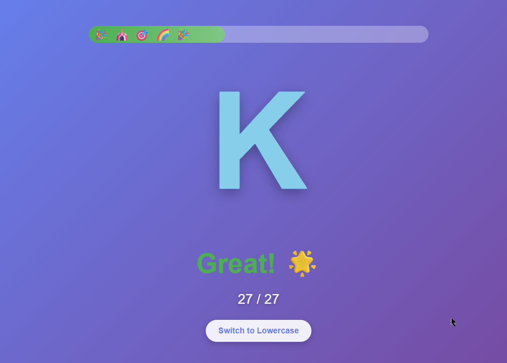

# Letter Quest 🎯

An interactive educational game designed to help children learn letters and numbers through keyboard practice. Features audio feedback, progress tracking, and a reward system to keep learners engaged and motivated.



## Features

✨ **Comprehensive Character Set**
- All English alphabet letters (A-Z)
- Norwegian special characters (Æ, Ø, Å)
- Numbers (0-9)

🎨 **Visual Feedback**
- Color-coded characters (vowels, consonants, numbers)
- Success and error animations
- Progress bar with visual indicators
- Sticker rewards for every 5 correct answers in a row

🔊 **Audio Support**
- Individual audio files for each character
- Error sound effects using Web Audio API
- Positive reinforcement sounds

📊 **Progress Tracking**
- Success count vs. total attempts
- Streak counter for consecutive correct answers
- Visual progress bar
- Collectible sticker rewards (⭐ 🎉 🏆 🎨 🌈 🦄 🎪 🎯)

⚙️ **Flexible Learning**
- Toggle between uppercase and lowercase modes
- Random character selection
- Adaptive difficulty through variety

## How to Use

1. **Open the Game**
   - Simply open `index.html` in a web browser

2. **Play the Game**
   - A letter or number will be displayed on screen
   - Press the corresponding key on your keyboard
   - Get instant feedback with visual and audio cues

3. **Toggle Case**
   - Click the "Switch to Lowercase/Uppercase" button to change between modes

4. **Earn Rewards**
   - Complete 5 correct answers in a row to earn a sticker
   - Watch your progress bar fill up with each success

## Technologies Used

- **HTML5** - Structure and layout
- **CSS3** - Styling and animations
- **JavaScript (ES6+)** - Game logic and interactivity
- **Web Audio API** - Error sound generation
- **HTML5 Audio** - Character pronunciation playback

## File Structure

```
Letter-Quest/
├── index.html      # Main HTML file
├── style.css       # Styling and animations
├── game.js         # Game logic and functionality
├── screenshot.png  # Game screenshot
└── README.md       # This file
```

## Browser Compatibility

Works best in modern browsers with support for:
- ES6 JavaScript
- Web Audio API
- HTML5 Audio elements
- CSS3 animations

## Future Enhancements

- [ ] Add difficulty levels
- [ ] Include word formation challenges
- [ ] Save progress locally
- [ ] Add more language support
- [ ] Mobile-friendly touch interface

## License

This project is open source and available for educational purposes.

---

Made with ❤️ for young learners
